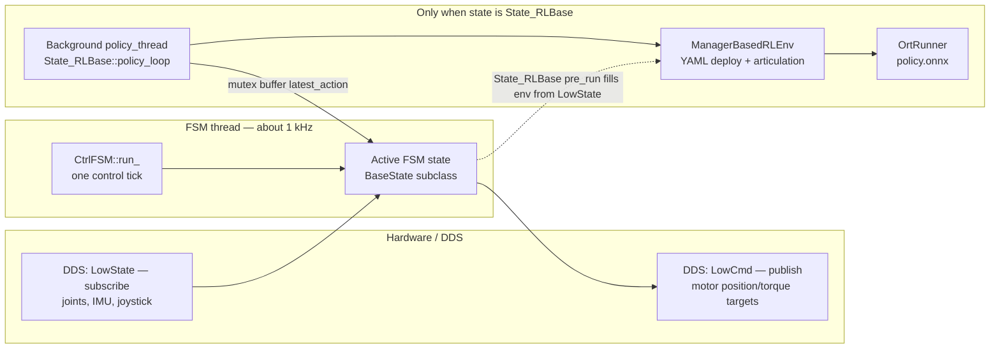

# Deploy runtime (on-robot control)

This tree is the C++ controller that runs on hardware: DDS I/O, a finite-state machine (FSM) for operator modes, and an Isaac Lab–aligned RL stack (YAML `deploy.yaml` + ONNX policy) for learned behaviors.

## Directory layout

| Path | Role |
|------|------|
| `include/FSM/` | FSM base classes, joystick-driven transitions, `State_RLBase` for ONNX policies |
| `include/isaaclab/` | Minimal runtime mirror of Isaac Lab: articulation data, observation/action managers, MDP helpers |
| `include/param.h` | Executable path, `config.yaml` load, CLI (`--network`, `--log`, …), policy directory resolution |
| `robots/<robot>/` | Per-robot `main.cpp`, `Types.h` (LowCmd/LowState aliases), `config/config.yaml`, optional `src/State_*.cpp` |
| `thirdparty/` | Bundled deps (e.g. ONNX Runtime, yaml-cpp) as used by the robot CMake projects |

Each robot target is a separate CMake project under `robots/<name>/` (for example `go2_ctrl` from `deploy/robots/go2`).

## Runtime architecture



**Diagram legend (read top to bottom):**

| Box | Meaning |
|-----|---------|
| **DDS: LowState — subscribe** | Incoming robot telemetry the controller reads (joint feedback, IMU, wireless remote state). Feeds the active FSM state each tick. |
| **DDS: LowCmd — publish** | Outgoing motor commands after `FSMState::post_run()` publishes `lowcmd`. |
| **CtrlFSM::run_** | One iteration of the FSM loop: call the current state’s hooks, then check transitions. |
| **Active FSM state** | Whatever `BaseState` subclass is current (`State_Passive`, `State_FixStand`, `State_RLBase`, …). Its `run()` fills `lowcmd` for non-RL states; for `State_RLBase` it mostly copies buffered joint targets. |
| **Background policy_thread** | Second thread only for `State_RLBase`: runs `policy_loop()` at `step_dt`, not at 1 kHz. |
| **ManagerBasedRLEnv** | Holds `deploy.yaml` config, the articulation bridge, observation and action managers, and the policy pointer. |
| **OrtRunner** | ONNX Runtime session for `exported/policy.onnx`. |

**Arrows:**

- **Solid `dds_robot_state → fsm_active_state`**: New robot data is consumed when the state runs (after `lowstate->update()` in `pre_run`).
- **Solid `fsm_active_state → dds_motor_cmd`**: After `run()`, `post_run()` publishes `lowcmd` to the robot.
- **Dashed `fsm_active_state → rl_environment`**: In `State_RLBase::pre_run`, `env->robot->update()` refreshes the same articulation object the policy uses, from `LowState`.
- **Solid `policy_worker → rl_environment`**: The policy loop updates observations and runs inference inside this env object.
- **Solid `rl_environment → onnx_runtime`**: `OrtRunner::act` is invoked with observation tensors.
- **Solid `policy_worker → fsm_active_state` (latest_action)**: `policy_loop` writes processed joint targets; `run()` on the FSM thread reads them under a mutex and writes motor `q` in SDK order.

**Threading in words:**

- **FSM thread** (`CtrlFSM`): Calls `pre_run` → `run` → `post_run` on a `RecurrentThread` with `dt = 0.001` s, evaluates transition predicates, and switches states when a predicate fires.
- **`FSMState`**: Static handles `lowcmd`, `lowstate`, optional `keyboard`. `pre_run` refreshes subscribed low-level state; `post_run` publishes the command buffer.
- **`State_RLBase`**: The 1 kHz path does not run ONNX each time; it applies the latest processed joint targets from the background thread. That thread runs `policy_loop()` at `env->step_dt` from `deploy.yaml` (observe → ONNX → `process_action` → optional surprise). That keeps policy rate and control publish rate independent.

## Components (classes and functions)

### Global maps and registration

| Symbol | Role |
|--------|------|
| `FSMStringMap` | `boost::bimap<int, std::string>`: numeric state id ↔ YAML name (`Passive`, `Velocity`, …). Filled when each `BaseState` is constructed and when `CtrlFSM` reads `FSM._`. |
| `getFsmMap()` | Singleton `std::unordered_map<std::string, FsmFactory>`. Keys are stringified class names (`State_RLBase`, `State_Passive`, …). |
| `REGISTER_FSM(Derived)` | Static initializer that inserts a factory `Derived(int id, std::string name)` into `getFsmMap()` under `"Derived"`. `CtrlFSM` looks up `"State_" + YAML["type"]`. |

### `param` (`include/param.h`)

| Name | Role |
|------|------|
| `get_bin_path()` | Reads `/proc/self/exe` to locate the binary. |
| `load_config_file()` | Sets `proj_dir` / `config_dir` from `bin_path`, loads `config_dir/config.yaml` into `param::config`. |
| `helper(argc, argv)` | Must run first in `main`: sets `bin_path`, loads YAML, parses `--network`, `--log`, `--help`, `--version`, configures spdlog. Returns `boost::program_options::variables_map`. |
| `parser_policy_dir(path)` | Resolves relative `path` under `proj_dir`; if no `exported/` at that path, searches subdirectories (sorted) from the end for one containing `exported/`. Returns the directory holding `params/` and `exported/`. |

### FSM

| Class / method | Role |
|----------------|------|
| **`BaseState`** | Holds `state_` id, `registered_checks` as `(predicate → target_state_id)` pairs. Hooks: `enter`, `pre_run`, `run`, `post_run`, `exit`. `getStateString()` / `isState()` use `FSMStringMap`. |
| **`CtrlFSM` (YAML ctor)** | Reads `cfg["_"]`: builds `FSMStringMap` for enabled entries, then for each enabled row instantiates `State_<type>` via `getFsmMap()` and `add()`. |
| **`CtrlFSM::add`** | Appends a state; aborts if duplicate id/name. |
| **`CtrlFSM::start`** | Sets `currentState = states[0]`, calls `enter()`, starts `RecurrentThread` calling `run_` every 1 ms. |
| **`CtrlFSM::run_` (private)** | `pre_run` → `run` → `post_run`; scans `registered_checks` in order; first true predicate yields `nextStateMode`; if different from current, `exit()`, switch `currentState`, `enter()`. |
| **`FSMState` ctor** | Reads `param::config["FSM"][state_string]["transitions"]`, compiles joystick DSL strings to lambdas over `lowstate->joystick`, appends `(predicate, target_id)` pairs. Always appends link loss → `Passive`. |
| **`FSMState::pre_run`** | `lowstate->update()`; optional `keyboard->update()`. |
| **`FSMState::post_run`** | `lowcmd->unlockAndPublish()`. |
| **`State_Passive`** | Optional per-motor `mode` from YAML; `enter` sets `kp=0`, `kd` from config; `run` copies measured `q` into command. |
| **`State_FixStand`** | Loads `ts`, `qs` keyframes; `enter` snapshots current `q` into `qs_[0]`, records `t0_`; `run` uses `linear_interpolate(t, ts_, qs_)` for commanded `q`. Optional `auto_velocity` adds a timed transition to `Velocity`. |
| **`State_RLBase`** | See table below. |
| **`linear_interpolate`** (`LinearInterpolator.h`) | Piecewise linear interpolation over `ts` and vector samples `ys`. |

#### `State_RLBase` (`include/FSM/State_RLBase.h` + robot `src/State_RLBase.cpp`)

| Method | Role |
|--------|------|
| **Constructor** | Loads `policy_dir` → `params/deploy.yaml`, builds `ManagerBasedRLEnv` + `OrtRunner(policy.onnx)`. Parses surprise target FSM, `parse_surprise_cfg`, `parse_intro_cfg`, `parse_auto_transition_cfg`. Pushes fall checks (`bad_orientation` / `bad_target_orientation`) and optional surprise / auto-transition predicates onto `registered_checks`. |
| **`enter`** | Resets surprise counters; records wall time; if intro keyframes exist, pins first keyframe to current `lowcmd` q, sets gains; starts `policy_thread` running `policy_loop()`. |
| **`pre_run`** | Calls `FSMState::pre_run()`, then `env->robot->update()` so IMU/joints match hardware before any check or policy read. |
| **`run`** | If intro active: `intro_current_q()` → write motor `q`. Else copy `latest_action` under mutex; map through `joint_ids_map` to motor indices in `lowcmd`. |
| **`exit`** | Stops policy thread, joins it, clears intro / auto-transition timers. |
| **`policy_loop`** | Timed loop at `step_dt`: `robot->update()`, `observation_manager->compute()`, `alg->act(obs_map)`, `action_manager->process_action`, store `processed_actions` in `latest_action`; optional `update_surprise_gate`; optional restore PD gains after intro. |
| **`parse_intro_cfg` / `intro_current_q`** | Optional `(ts, qs)` trajectory; empty first row in YAML means “start from current pose”. |
| **`parse_auto_transition_cfg`** | After `duration_s` wall seconds (and intro finished), transition predicate becomes true. |
| **`parse_surprise_cfg` / `setup_surprise_model` / `update_surprise_gate` / `surprise_trip_check`** | Optional ONNX forward model + normalization stats; accumulates surprise score; `surprise_trip` drives an FSM transition via `registered_checks`. |

### Isaac Lab mirror (`include/isaaclab/`)

| Class | Role |
|-------|------|
| **`Articulation`** | Abstract robot handle; default `update()` no-op. `ArticulationData` holds IMU-derived `projected_gravity_b`, `root_ang_vel_b`, joint vectors, stiffness/damping, `joint_ids_map`, joystick pointer. |
| **`unitree::BaseArticulation<LowStatePtr>`** | `update()` copies gyro, quaternion → gravity in body frame, joint `q`/`dq` from `lowstate` using `joint_ids_map` indices. |
| **`ManagerBasedRLEnv`** | Ctor: reads `step_dt`, maps, gains, default posture from YAML; constructs `ActionManager`, `ObservationManager`; calls `robot->update()`. Holds `std::unique_ptr<Algorithms> alg` (set to `OrtRunner` by `State_RLBase`). |
| **`ManagerBasedRLEnv::step`** | One RL step for parity with sim: increment episode length, `robot->update()`, `observation_manager->compute()`, `alg->act`, `action_manager->process_action`. Not the main hardware path (see `policy_loop` + `run`). |
| **`ObservationManager`** | From YAML `observations` groups: each group lists terms with scale/clip/history; `compute()` returns `unordered_map<group_name, vector<float>>` (concatenated terms, optional history stacks). |
| **`ActionManager`** | From YAML `actions`: instantiates registered terms in order. `process_action(raw)` slices the flat vector by each term’s `action_dim()` and calls `term->process_actions(slice)`; `processed_actions()` concatenates each term’s processed joint commands. |
| **`Algorithms`** | Interface: `act(obs_map) -> vector<float>` (raw policy output). |
| **`OrtRunner`** | Loads ONNX; `act` builds input tensors from `obs_map` keys matching ONNX input names, runs session, returns first output tensor as flat float vector. |
| **`isaaclab::mdp::*`** (`terminations.h`, `observations.h`, `joint_actions.h`) | `REGISTER_OBSERVATION` / `REGISTER_ACTION` populate global maps used by managers. |

### Other

| Name | Role |
|------|------|
| **`Keyboard`** | Optional stdin thread for key events where the robot `main` wires `FSMState::keyboard`. |

## Algorithms (pseudo-code)

Names are spelled out on purpose: `target_state_id` is the numeric FSM id from YAML; `registered_checks` pairs a predicate with where to go next. In observation pseudo-code, `group` is one YAML observation group (often matching one ONNX input tensor name); `term` is one line inside that group (e.g. `projected_gravity`).

### FSM main loop (`CtrlFSM::run_`)

```text
function run_():
    currentState.pre_run()
    currentState.run()
    currentState.post_run()

    next_state_id ← 0
    for (transition_predicate, target_state_id) in currentState.registered_checks:
        if transition_predicate():
            next_state_id ← target_state_id
            break

    if next_state_id != 0 and next_state_id != currentState.id:
        for candidate in all_registered_states:
            if candidate.id == next_state_id:
                currentState.exit()
                currentState ← candidate
                currentState.enter()
                break
```

### YAML transition compilation (`FSMState` constructor)

```text
for each (target_fsm_name, joystick_dsl_string) in config["FSM"][state_name]["transitions"]:
    target_state_id ← FSMStringMap.name_to_id[target_fsm_name]   // warn if missing
    syntax_tree ← Parse(joystick_dsl_string)                      // Unitree joystick DSL
    evaluate_joystick ← Compile(syntax_tree)                    // bool from joystick snapshot
    registered_checks.append( ( () -> evaluate_joystick(lowstate.joystick), target_state_id ) )

registered_checks.append( ( () -> lowstate.isTimeout(), Passive_state_id ) )
```

### RL state: two-rate split (`State_RLBase`)

```text
// Thread A — background policy_thread — period = step_dt from deploy.yaml (slower than FSM)
function policy_loop():
    env.reset()
    call process_action once with a zero raw vector  // seeds stable joint targets before first ONNX step
    while policy_thread_running:
        env.robot.update()
        observations_by_name ← env.observation_manager.compute()
        raw_policy_output ← env.alg.act(observations_by_name)   // OrtRunner / ONNX
        env.action_manager.process_action(raw_policy_output)
        latest_action ← env.action_manager.processed_actions()    // shared with Thread B under mutex
        if surprise gate enabled:
            update_surprise_gate(observations_by_name["obs"], raw_policy_output)
        sleep until next step_dt boundary

// Thread B — FSM RecurrentThread — about 1 kHz (State_RLBase hooks only)
function State_RLBase.pre_run():
    FSMState.pre_run()              // lowstate.update(), optional keyboard.update()
    env.robot.update()              // same articulation as Thread A, fed from LowState

function State_RLBase.run():
    if intro keyframe phase still running:
        write joint positions from intro_current_q() into lowcmd
        return
    joint_targets ← latest_action   // same mutex as policy_loop write
    for each policy joint index i:
        lowcmd.motor[joint_ids_map[i]].q ← joint_targets[i]
```

### Policy directory resolution (`param::parser_policy_dir`)

```text
path ← resolve(proj_dir, policy_dir_argument)
if exists(path / "exported"):
    return path
dirs ← sorted subdirectories of path
for dir in reverse(dirs):
    if exists(dir / "exported"):
        return dir
return path   // may still be invalid; caller loads YAML/ONNX and fails if missing
```

### Observation bundle (`ObservationManager::compute`)

```text
for each observation_group_name, group_config in deploy.yaml observations:
    for each observation_term in group_config:
        raw_vector ← registered_observation[observation_term.name](env, observation_term.params)
        observation_term.add(raw_vector)   // scale, clip, push history deque

    if history stacking enabled for this group:
        concatenate history slices into one flat vector for this group
    else:
        concatenate latest vectors from each term in this group

return map: observation_group_name → flat float vector (one entry per ONNX input group)
```

### Raw policy output → motor targets (`ActionManager::process_action`)

```text
// raw_policy_output is the flat ONNX output; length = sum of action_dim() over all action terms
slice_start ← 0
for each action_term in registration order (matches deploy.yaml actions:):
    one_term_slice ← raw_policy_output[slice_start : slice_start + action_term.action_dim()]
    action_term.process_actions(one_term_slice)   // e.g. JointAction: scale/add → absolute joint q
    slice_start += action_term.action_dim()
```

## Startup sequence

1. `param::helper(argc, argv)` resolves the binary path, loads `config/config.yaml` next to the executable (or under `../config` when run from `bin/` or `build/`), configures logging.
2. DDS `ChannelFactory::Init` with optional `--network` interface.
3. Robot-specific `init_fsm_state()`: constructs `LowCmd` / `LowState`, waits for connection.
4. `CtrlFSM(param::config["FSM"])` reads the `FSM._` table: registers enabled states by `id`, instantiates each by `type` (maps to `State_<type>` via `REGISTER_FSM`).
5. `fsm->start()`: enters the **first** state in registration order (typically `Passive`), starts the FSM thread.

## FSM configuration (`config.yaml`)

Top-level key `FSM` has two roles:

### `FSM._` — enabled states registry

For each mode name (e.g. `Velocity`):

- `id`: numeric id used in transitions and `BaseState`.
- `enabled`: if `false`, the state is omitted from the map and not constructed.
- `type`: C++ class suffix; factory looks up `State_<type>` (e.g. `RLBase` → `State_RLBase`). Defaults to the YAML key name if omitted.

Order in the file determines construction order; the **first enabled** state is the initial state after `start()`.

### `FSM.<StateName>` — per-state settings

- **`transitions`**: Map *target FSM name* → joystick DSL expression (see Unitree `unitree_joystick_dsl`). Compiled to lambdas that read `lowstate->joystick`. Targets must appear in `FSM._` or transitions log a warning.
- **`State_RLBase` states** additionally use:
  - `policy_dir`: Directory containing `params/deploy.yaml` and `exported/policy.onnx`. Relative paths are resolved from the project directory. If there is no `exported/` directly under that path, the loader picks the **last** subdirectory (sorted) that contains `exported/`.
  - `bad_orientation_limit`, optional `bad_orientation_desired_gravity`: deploy-side fall detection (see `isaaclab/envs/mdp/terminations.h`).
  - `intro`: optional keyframed joint interpolation before the policy runs.
  - `auto_transition`: optional timed switch to another FSM (e.g. recover → guarded walk).
  - `surprise`: optional forward-model gate (ONNX + stats YAML) to trigger a transition when a surprise score exceeds a threshold.

`FSMState` always appends a transition to `Passive` when `lowstate->isTimeout()` fires.

## Training export

Training writes `params/deploy.yaml` via `unitree_rl_lab.utils.export_deploy_cfg`. That file must stay consistent with the ONNX inputs (names and tensor shapes) and with observation/action term names registered in C++.

## Extending the controller

### New FSM state (non-RL)

1. Define `class State_MyMode : public FSMState` in `include/FSM/` (or robot `include/`).
2. Implement `enter` / `run` / `exit` as needed; use `registered_checks` in the constructor for automatic transitions, or rely on `FSM.<name>.transitions` in YAML (base `FSMState` constructor).
3. Add `REGISTER_FSM(State_MyMode)` at the end of the header (see `BaseState.h`).
4. Include the header in the robot’s `main.cpp` so the static registrar runs.
5. Add the state under `FSM._` and `FSM.MyMode` in `config.yaml`.

### New RL-backed state

Reuse `State_RLBase` with a new `FSM._` entry and `type: RLBase` (or name the state so the default `type` matches). Point `policy_dir` at a run with valid `deploy.yaml` and `exported/policy.onnx`.

### New observation or action term

1. Implement a function or `ActionTerm` subclass and register with `REGISTER_OBSERVATION` / `REGISTER_ACTION` in the corresponding `.h` files.
2. Reference the term name in the exported `deploy.yaml` under `observations` / `actions`.

### Robot-specific binary

Copy an existing `robots/<model>/` tree, adjust `Types.h`, DDS init, `main.cpp` includes, and `CMakeLists.txt` include/link paths. Keep `deploy/include` shared headers on the include path.

## Build (example: Go2)

From `deploy/robots/go2`:

```bash
mkdir -p build && cd build
cmake ..
cmake --build .
```

Run the binary from a working directory where `config/config.yaml` is found (typically install or run from the `build` output next to `config/`). Use `-h` for CLI options.

## Threading and safety notes

- `State_RLBase::pre_run` calls `env->robot->update()` so fall checks and observations see a current IMU at FSM rate, not only at policy decimation.
- Joint commands in `run()` use `joint_ids_map` to map policy joint order to motor indices.
- `intro_running` blocks `auto_transition` until the intro trajectory finishes (when both features are configured).

For operator-facing shortcuts and policy layout details, see the comments at the top of each robot’s `config/config.yaml` (the Go2 file is heavily annotated).
